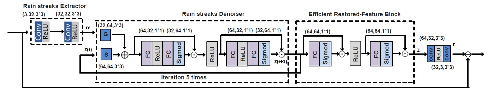

# Low-Complexity-Deep-Learning-Algorithm-for-Single-Image-Rain-Removal

# Abstract
	With the advancement of artificial intelligence (AI) technology, many products have gradually integrated AI to enhance functionality and convenience, particularly in the fields of electric vehicles and unmanned aerial vehicles (UAV). Currently, most electric vehicles are equipped with Advanced Driver Assistance Systems (ADAS) to reduce driver fatigue and provide real-time support in critical situations. Real-time image processing is crucial to the effectiveness of ADAS. However, external factors such as weather conditions can degrade image quality, thereby affecting the system’s decision-making accuracy and compromising driving safety. In addition, UAV are increasingly used in rescue operations, offering rapid search and detection capabilities. Nevertheless, adverse weather, especially rainy conditions can negatively impact image quality, reducing UAV performance and affecting rescue efficiency. To address these issues, this study proposes a computationally efficient and low-complexity image deraining model, composed of three modules: the Rain Streak Extractor (RSE), the Rain Streak Denoiser (RSD), and the Efficient Restored-Feature Block (ERB). Experimental results show that compared with recent image deraining methods, the proposed model significantly reduces computational cost, parameter count, and network depth achieving up to 4T reduction in computation. Moreover, the proposed method maintains competitive visual quality in deraining performance.
	

