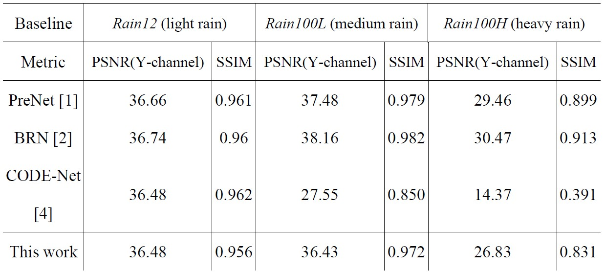

# Low-Complexity Deep Learning Algorithm for Single Image Rain Removal

## Abstract
With the advancement of artificial intelligence (AI) technology, many products have gradually integrated AI to enhance functionality and convenience, particularly in the fields of electric vehicles and unmanned aerial vehicles (UAV). Currently, most electric vehicles are equipped with Advanced Driver Assistance Systems (ADAS) to reduce driver fatigue and provide real-time support in critical situations. Real-time image processing is crucial to the effectiveness of ADAS. However, external factors such as weather conditions can degrade image quality, thereby affecting the system’s decision-making accuracy and compromising driving safety.

In addition, UAV are increasingly used in rescue operations, offering rapid search and detection capabilities. Nevertheless, adverse weather, especially rainy conditions, can negatively impact image quality, reducing UAV performance and affecting rescue efficiency.

To address these issues, this study proposes a computationally efficient and low-complexity image deraining model, composed of three modules: the Rain Streak Extractor (RSE), the Rain Streak Denoiser (RSD), and the Efficient Restored-Feature Block (ERB). Experimental results show that compared with recent image deraining methods, the proposed model significantly reduces computational cost, parameter count, and network depth, achieving up to 4T reduction in computation. Moreover, the proposed method maintains competitive visual quality in deraining performance.

  

# Dataset
## Synthetic Datasets
| Datasets | #train | #test | label |
   | :------- | -----: | ----: | :-----: |
   | Rain12|-| 12   |-|
   | Rain100L| 200    | 100   | -|
   | Rain100H| 1800   | 100   | -|
   | Rain1200| 12000  | 1200  | -|
   | Rain1400| 12600  | 1400  | - |
   
# Pre-trained Model
**Use NVIDIA GeForce GTX3090**  
**Rain100L & Rain12 ./experiments/Rain100L**  
**Rain100H ./experiments/Rain100H**  

# Results
## FLOPs & Parameters & Layer analysis

  

## PSNR & SSIM analysis

  

## Subjective analysis

   
  <b>Light Rain</b>  
   
  <b>Medium Rain</b>  
   
  <b>Heavy Rain</b>

# Conclusions
This study focuses on rain image processing and proposes a single-image deraining algorithm based on deep learning, emphasizing low computational complexity. The proposed model—comprising RSE, RSD, and ERB modules—demonstrates excellent visual quality with superior PSNR and SSIM performance. It effectively adapts to various rainfall intensities, showcasing strong adaptability and deraining stability.

In terms of model performance, the proposed method consistently achieves stable results on benchmark datasets such as Rain12, Rain100L, and Rain100H. Notably, it maintains a PSNR above 26 dB and an SSIM over 0.83 even under heavy rain conditions, indicating its robust capability to restore clear images in high-rainfall scenarios. Moreover, the entire model consists of only 32 layers, approximately 101K parameters, and 73.7 GFLOPs, significantly reducing resource consumption while preserving high visual quality. Compared to existing large-scale models like CODE-Net, this model achieves a 70% to 90% reduction in FLOPs (saving 200G to 4T) and a 40% to 90% reduction in parameter count (saving 68K to 1.25M), demonstrating high resource efficiency and potential for hardware deployment.

In summary, the proposed low-complexity single-image deraining algorithm balances deraining effectiveness with hardware friendliness. It effectively enhances environmental perception for autonomous vehicles in adverse weather conditions and holds great promise for future applications in image preprocessing and embedded systems.